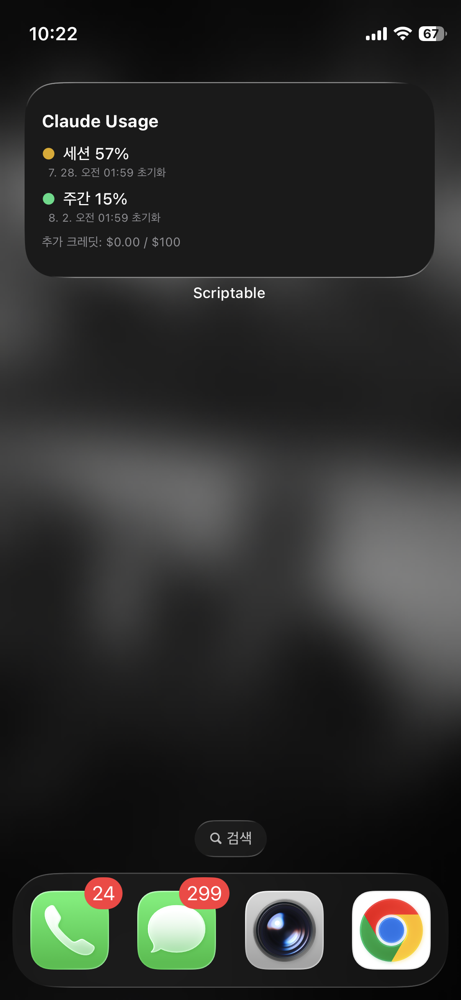

# Claude Usage Widget

A [Scriptable](https://scriptable.app) widget that shows your Claude.ai session and weekly usage limits right on your iPhone Home Screen.

## How it works

This is **not** an official Anthropic integration. It reuses the same authenticated request the claude.ai web app makes to its own usage endpoint, using your personal `sessionKey` cookie. Your session key is stored only in your device's iOS Keychain (scoped to the Scriptable app) and never leaves your phone except in the direct request to `claude.ai`.

Because this relies on an undocumented, internal endpoint, it may break at any time if Anthropic changes it.

## Setup (iPhone)

1. Install [Scriptable](https://apps.apple.com/app/scriptable/id1405459188) from the App Store (must be done on iPhone, not the Mac App Store).
2. Open Scriptable, tap **+** to create a new script, and paste in the contents of [`ClaudeUsage.js`](ClaudeUsage.js).
3. Tap the **Run** (▶) button once, inside the app (not as a widget yet).
4. Get your own `sessionKey`:
   - Log in to [claude.ai](https://claude.ai) in a desktop browser.
   - Open DevTools → Application (Chrome) / Storage (Safari) → Cookies → `https://claude.ai`.
   - Copy the value of the `sessionKey` cookie.
5. Paste that value into the popup shown by the script. It's saved to the iOS Keychain and the script auto-detects your organization ID from your account.
6. Long-press your Home Screen → **Add Widget** → search **Scriptable** → choose the small size → add it.
7. Edit the new widget and set its **Script** to the one you created.

## Security notes

- Never share your `sessionKey` with anyone — it's equivalent to being logged in to your account.
- If you ever paste it somewhere by accident, log out of claude.ai and log back in to invalidate it.
- This script only reads usage data. It doesn't post messages or change any account settings.

## License

MIT
